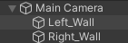

# Dev Diary - Serious Games Projekt

Von Ella Pohl und Ruben Härle

---

## Link

[Link zum Spiel](https://link_ins_nichts)

---

## Aufgabe 1

### Zeitraum: 

- 23.Mai – 30.Mai

### Aufgaben:

Wir beide haben Unity installiert und angefangen die Entwicklungsumgebung zu erkunden. Dabei haben wir festgestellt, dass es verschiedene Templates für verschiedene Arten von Spielen gibt, zum Beispiel 3D Welten, oder 2D Runner Welten. Wir haben uns für eine plane 2D Welt entschieden, da dies am besten zu unserer Aufgabe gepasst hat. Dabei haben wir uns für unsere Erkundung stark an den bereitgestellten Links aus der Aufgabenstellung orientiert.

Als nächstes haben wir uns dazu entschieden ganz einfach anzufangen. Das heißt, wir haben als Bohrer ein Dreieck genommen und als Begrenzungen für die rechte und linke Seite zwei statische Rechtecke. Damit die Begrenzungen nicht aus dem Bild verschwinden, haben wir sie mit unserer Hauptkamera verbunden. So bewegen sich die Rechtecke immer dahin wo auch die Kamera hinbewegt wird.



Als nächstes haben wir die Kamera mit ihrer y-Achse an die Kamera gekoppelt, damit wir der Drill immer folgen können. Bis jetzt ist der x-Achsen Wert der Drill ein fester Wert, soll aber in späteren Aufgaben überschrieben werden können. Aktuell fällt die Drill einfach nach unten und die Kamera folgt ihr.

```c#
// Camera default following the drill only on y direction
camera.transform.position = new Vector3(0, transform.position.y - centerOffsetCamera, -10); 
```

Unsere letzte Aufgabe für diese Woche war die Implementierung eines Menüs. Hierfür haben wir eine neue Szene angelegt in der wir einen Canvas angelegt haben in den wir Text und Buttons hinzugefügt haben, einmal um das Spiel zu starten und einmal um es zu beenden. Außerdem haben wir noch zwei Platzhalter hinzugefügt, einmal für einen Highscore und einen Slider, um möglicherweise später die Lautstärke zu regeln.

### Probleme:

Zu Anfang sind unsere Bildbegrenzungen nicht auf Höhe des Bohrers bzw. der Kamera geblieben. Nach einiger Recherche konnten wir herausfinden, dass man in der Hierarchie Objekte untereinander anordnen kann, was dazu führte, dass die Begrenzungen auf Höhe der Kamera und Bohrers blieben. 

Ein anderes Hindernis war die Implementierung des Menüs. Zu Anfang versuchten wir alles in einer Szene zu implementieren. Dies erwies sich jedoch als sehr schwierig. Deshalb entschieden wir uns eine separat Szene zu verwenden, und dort eine Transition zu einer anderen Szene mit Hilfe eines Buttons zu implementieren.  

```c#
public class Menu : MonoBehaviour
{
    [SerializeField] private TMP_Text textUI;

    public void Start(){
        textUI.text = "Highscore:"; // here we will add the value of the highscore
    }
    
    public void move_to_scene(string scene_name) 
    {
        SceneManager.LoadScene(scene_name);
    }   
}
```

## Aufgabe 2

### Zeitraum:

- 30.Mai – 6.Juni

### Aufgaben:

Für die Steuerung des Bohrers haben wir einige mathematische Funktionen von C# verwendet. Die Kurvenrichtung wird durch einen positiven bzw. negativen Faktor von $1$ bzw. $-1$ für rechts bzw. links gesteuert. Um eine schönere Kurvenbewegung zu bekommen interpolieren wir anhand aktueller Geschwindigkeit, Richtung und Rotationsgeschwindigkeit die neue Bewegungsrichtung.  Dies wird nun in die Rotation des Bohrers übersetzt. Anschießend setzten wir die aktuelle Geschwindigkeit, da diese sich in unterschiedlichen Erdschichten ändern kann.

```c#
if(Input.GetKeyDown(Right))
        { moveDirection = 1;
        }else if(Input.GetKeyUp(Right))
		{ moveDirection = -1; }
// Linear Interpolation for smoother rotation
currentMoveDirection = Mathf.Lerp(
    	currentMoveDirection, moveDirection, rotation_speed*Time.deltaTime); 
// Rotation angle
transform.rotation = Quaternion.Euler(0, 0, default_angle*currentMoveDirection); 
// Drill going locally down
RB.velocity = (transform.up * -1) * MoveSpeed;  
```

Damit unsere Drill nicht rechts und links aus dem Bild laufen kann, haben wir jeweils einen *Box Collider 2D* an den Rändern angebracht. Nach oben kann der Bohrer nicht aus dem Bild laufen, da der Bewegungsradius immer so gewählt wird, dass der Bohrer keine 180° Wendung machen kann. Des weiteren kann die Kamera dem Bohrer nur in y-Achsen Richtung folgen.

Als Implementierung für Hindernisse haben wir uns für 3 Arten entschieden. Ein größeres unbewegliches, ein kleines Bewegliches und ein kleines unbewegliches. Das bewegliche Hindernis wandert dabei immer von rechts nach links oder umgekehrt.

Berührt der Bohrer ein Hindernis ist er anfangs leicht rot und färbt sich bei einer zweiten Berührung noch stärker rot. Bei der dritten ist das Spiel vorbei und der Spieler gelangt zurück ins Hauptmenü. Nach einem Zusammenstoß wird das entsprechende Hindernis zerstört.

 ```c#
 Color red_light = new Color(1f, 0.5f, 0.5f); // leicht rot
 Color red_dark = new Color(1f, 0f, 0f); // stark rot
 if (collision.gameObject.CompareTag("Obstacle")){
     counter += 1;
     // change color of drill after collision
 	if (counter == 1) Drill.material.color = red_light; 
     if (counter == 2) Drill.material.color = red_dark; 
     Destroy(collision.gameObject); // destroy obstacle
     ...
 }
 ```

Das Spiel wird außerdem beendet wenn der Spieler den Erdkern erreicht. In unserem Fall ist dies eine Tiefe von 600 Scorepunkten. 

```c#
// TODO Code einfügen
```

### Probleme:
```c#
// TODO 
```

## Aufgabe 3

### Zeitraum:

- 6.Juni – 13.Juni

### Aufgaben:

Um den Score zu berechnen machen wir uns die y-Koordinaten zu Nutze. Hierbei subtrahieren wir die aktuelle y-Position von der Start y-Position und erhalten so einen Score.

```c#
// calculate score
current = (int)(transform.position.y + 0.5f);
score = (int)(start+0.5f) - current;
```

Um etwas Abwechslung in den Hintergrund zu bringen, haben wir uns für 5 verschiedene Hintergründe entschieden. Wechselt ein Hintergrund, so wechselt sich auch die Geschwindigkeit und Radius des Bohrers. Hierfür haben wir 5 Einstellungen getroffen:

```c#
private void OnTriggerEnter2D(Collider2D other) {
    if (other.gameObject.CompareTag("Erdschicht1")){
        Debug.Log("Erdschicht1");
        default_angle = 20;
        MoveSpeed = 8;
    }
    if(other.gameObject.CompareTag("Erdschicht2")){
        Debug.Log("Erdschicht2");
        default_angle = 40;
        MoveSpeed = 10;
    }
    if(other.gameObject.CompareTag("Erdschicht3")){
        Debug.Log("Erdschicht3");
        default_angle = 50;
        MoveSpeed = 10;
    }
    if(other.gameObject.CompareTag("Erdschicht4")){
        Debug.Log("Erdschicht4");
        default_angle = 10;
        MoveSpeed = 13;
    }
    if(other.gameObject.CompareTag("Erdschicht5")){
        Debug.Log("Erdschicht5");
        default_angle = 20;
        MoveSpeed = 14;
    }
}
```

Damit die Hindernisse unberechenbar bleiben, spawnen wir die Hindernisse an zufälligen Stellen und in zufälligen Arten.

```c#
// Zufälliges Hindernis (klein/groß/beweglich)
GameObject obst = Instantiate(
    hindernisse[Random.Range(0,hindernisse.Length)], this.transform) as GameObject;
// Zufällige Position
obst.transform.localPosition = new Vector3(
    Random.Range(7.3f,-7.3f),Random.Range(firstSpawn,firstSpawn-12f),0);
```

### Probleme:
```c#
// TODO 
```

## Aufgabe 4

### Zeitraum:

- 13.Juni – 20.Juni

### Aufgaben:

In dieser Aufgabe haben wir 3 Meilensteine implementiert. Diese werden bei einem Score von 150, 300, 450 angezeigt. Im [Bild][Bild1] unten ist ein Beispiel zu sehen.  Während des Spiels spricht Zark in einer von [AI generierten](https://micmonster.com/) Stimme zusätzlich, das was auf dem Bild geschrieben steht. Im Bild ist auch zusehen, wie groß der Fortschritt bzw. der noch verbleibende Weg ist.

[Bild1]: ./README_images/image-20230629225744920.png

![Meilenstein][Bild1]

### Probleme:

Ein großes Problem war die Einbindung der Audiospur. Zu beginn der Einbindung war trotz einwandfreier mp3-Files kein klares Audio zu hören. Die Tonspur war so verzehrt, das nichts verstanden werden konnte. Letztendlich ... **GRUND EINFÜGEN**  

## Aufgabe 5

### Zeitraum:

- 20.Juni – 04.Juli

### Aufgaben:

Im Hauptmenü kann der aktuelle (lokale) Highscore gesehen werden über den beiden Menü-Punkten *Story* und *Endless*. In unserem Fall ist *Story* der vorgegebene Modus aus den Aufgaben und *Endless* ist eines unserer Zusatz-Features. Wie der Name besagt, handelt es sich hierbei um eine Variante in der der Spieler ins unendliche spielen kann, ohne Story Unterbrechungen, dies ist für diejenigen, die wirklich wissen wollen wie weit sie in die Erde vordringen können. Das andere ist eine weitere Art von Hindernis, die [oben](#Aufgabe2) schon genannt wurde. So haben wir nämlich 3 anstatt den vorgegebenen 2 Hindernissen. Des weiteren kann die Tonspur im Hauptmenü stumm geschaltet werden.

Zur Optimierung haben wir zwei Dinge getan einmal werden unsere Hindernisse zerstört sobald sie die Bildfläche nach oben verlassen, zum anderen zerstören wir auch unsere Hintergründe, die besonders im *Endless*-Mode zum Problem werden können. Dies haben wir durch eine `Queue` gelöst. In diese werden die Hinderniss und Hintergrund Objekte angefügt und nach dem FIFO Prinzip auch wieder zerstört. Code Beispiel für die Hindernisse:

```c#
GameObject obst = Instantiate(...) as GameObject;
obst.transform.localPosition = new Vector3(...);
// An die Queue anfügen
obstQueue.Enqueue(obst); 

// Wenn mehr als 6 Hindernisse auf dem Bild sind, ist das erste außerhalb des Bildes
if(obstQueue.Count > 6){
    // erstes eingegangenes Objekt wird zerstört
    Destroy(obstQueue.Dequeue());
}
```

Der Link zum Spiel kann [oben](#Link) im Dokument gefunden werden.

### Probleme:

```c#
// TODO 
```
